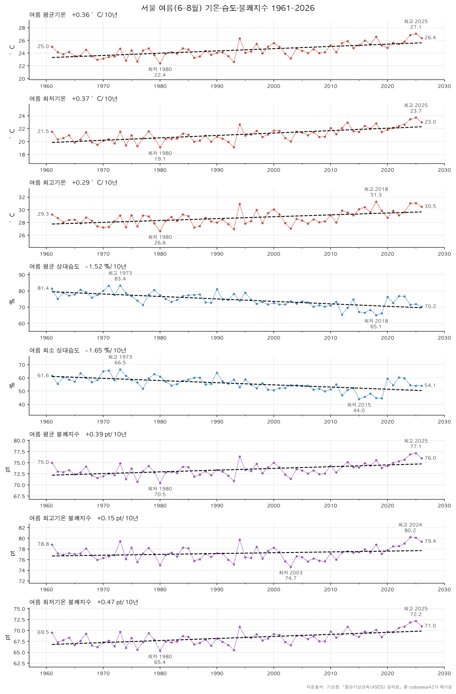
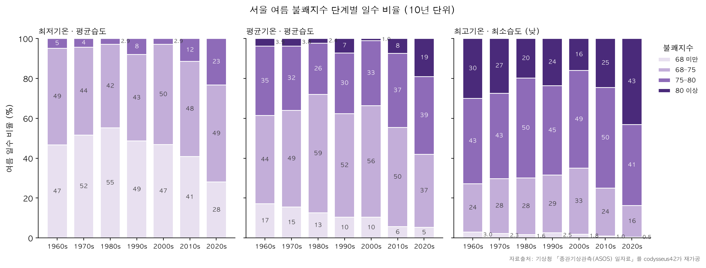
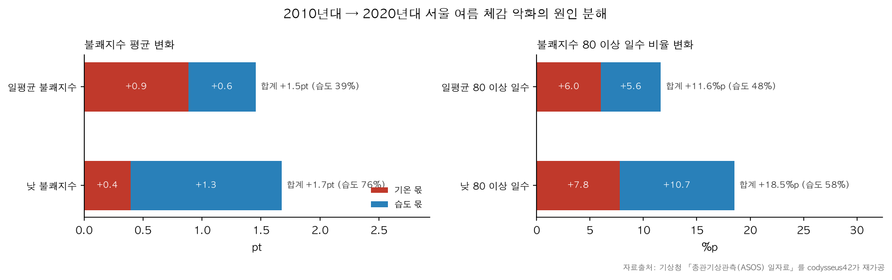
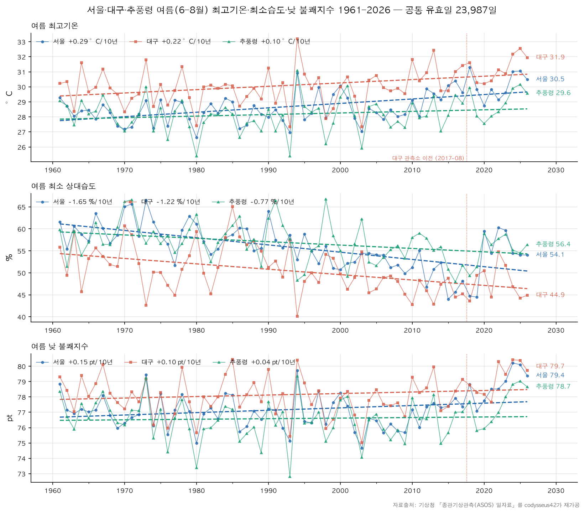
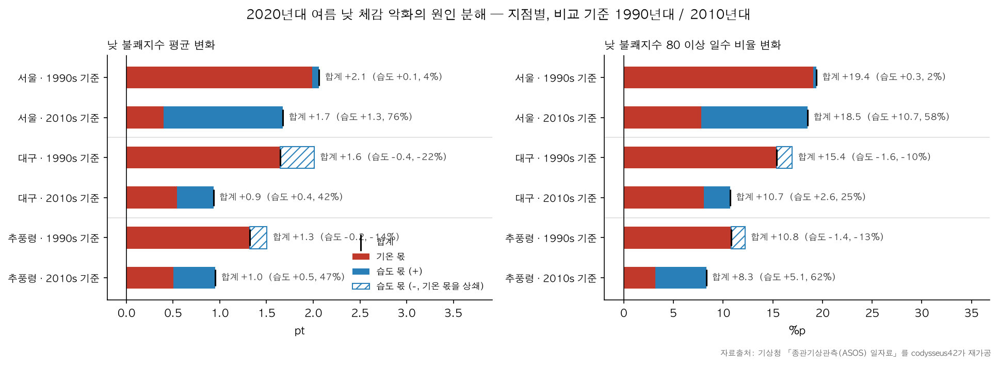
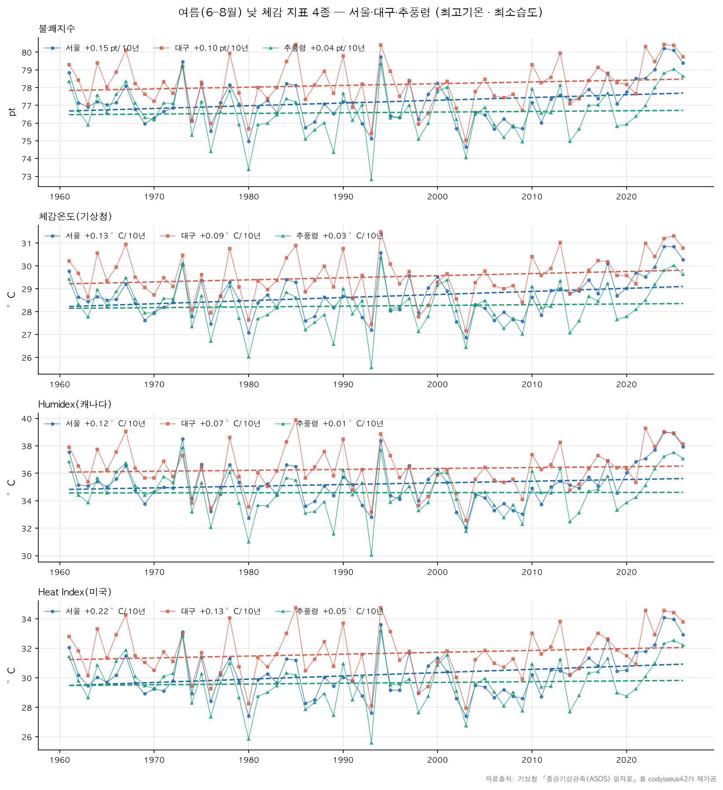
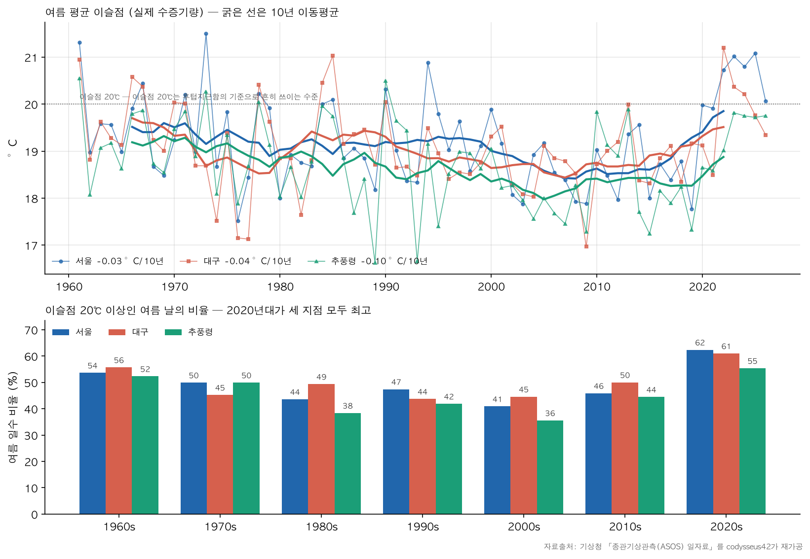

# 여름이었다.

## 목차
1. [분석 주제 및 선정 이유](#1-분석-주제-및-선정-이유)
2. [분석 질문](#2-분석-질문)
3. [축, 스케일, 집계 단위](#3-축-스케일-집계-단위)
4. [데이터 설명, 전처리](#4-데이터-설명-전처리)
5. [분석 결과 및 시각화](#5-분석-결과-및-시각화)
6. [인사이트](#6-인사이트)
7. [결론 및 한계점](#7-결론-및-한계점)
8. [AI 사용 로그](#8-ai-사용-로그)
9. [참고 자료](#9-참고-자료)

## 1. 분석 주제 및 선정 이유

- 1960~2026년 사이에 축적된 일별 기후 관측 데이터를 바탕으로 서울시의 체감 기후 생활조건의 변화를 통찰하는 분석입니다. 특히 인터넷 등에서 온도보다 여름철 불쾌감의 원인으로 지목되는 습도와의 관계에 주의하여, 습도가 어느정도 영향을 미치는지 불쾌지수등의 생활기후지표를 통해서 알아보자 합니다.
- 대중에 통용되는 속설과 지금은 잘 사용되지 않지만 널리 사용되었던 휴리스틱 지표를 비교하여 어느쪽이 타당하다는 결론을 내리지 못하더라도 그 그럴싸함에 대해 합리적으로 고찰하고 싶었습니다.
- 지나치게 관계가 복잡한 기후의 상관관계보다 온도와 습도등 직관적이고 비교적 확실한 지표와 익숙한 휴리스틱을 통해서 기후와 인간 생활에 대한 통찰을 얻어보고 싶었습니다.  

## 2. 분석 질문
- Q1 습도의 증가는 기온의 증가와 비례하지만 다를 수 있다. 서울의 습도 변화는 불쾌지수에 얼마나 기여했을까? - 서울의 온도, 습도, 불쾌지수
- Q2 동일한 분석을 다른 지역 데이터에 적용하여 서울과 다른 차이를 볼 수 있을까? - 추풍령, 대구
- Q3 불쾌지수를 제외한 다른 생활 기후 지표로 분석해보면 다른 결과가 나올까? — 체감온도(기상청), Humidex(캐나다), Heat Index(미국)

## 3. 축, 스케일, 집계 단위

### 사용한 시계열 기법
- 계절 집계: 여름(6~8월)만 모아 연평균을 내 계절 변동을 제거
- 선형 추세: 연도별 여름 평균에 최소제곱 직선, 10년당 변화량
- 이동평균: 365일(서울 전체 일별 그림), 10년(이슬점 그림)
- 구간별 통계: 10년 단위 평균, 불쾌지수 80 이상·이슬점 20℃ 이상 일수 비율
- 원인 분해: 습도만 기준 시기 수준으로 옮겨 다시 계산해 기온 몫과 습도 몫을 나눔

### 집계 단위 — 일 → 여름 → 10년
1. **일 단위 계산**: 모든 체감 지표는 하루 단위의 기온·습도로 먼저 계산한 뒤 평균을 냈다.
   지표 식이 비선형이라 평균 기온·습도를 넣으면 결과가 달라지기 때문이다.
   - 일평균 기준: 평균기온 + 평균 상대습도
   - 낮 기준: 최고기온 + 최소 상대습도 (두 값이 관측된 시각의 차이는 중앙값 38분, 78%가 2시간 이내 결측값 제외)
2. **여름(6~8월) 연평균**: 일별 원자료에서는 계절 변동(여름과 겨울의 차이 약 30°C)이 66년간의 변화(약 2°C)를 가린다.
   매년 여름 92일만 평균 내 계절 성분을 제거했다. 불쾌감이 문제가 되는 계절도 여름이다.
3. **10년 단위**: 1960년대~2020년대. 불쾌지수 80 이상 일수 비율, 기준 시기와의 비교(원인 분해)에 사용했다.
   2020년대는 2020~2026년, 여름 7개다.

### 축
- 가로축은 연도(1961~2026, 10년 눈금)이며, 10년 단위 비교는 구간(1960s, 1970s …)으로 표시했다.
- 세로축은 각 지표의 고유 단위(°C, %, pt)를 쓴다. 단위가 다른 지표를 한 축에 겹치지 않고 패널을 나눴다.
- 지점 비교는 같은 축에 세 지점을 겹쳐, 지점 간 수준 차이가 그대로 보이게 했다.

### 스케일
- 모든 축은 선형이다. 기온·지수는 0이 의미 있는 기준값이 아니므로 세로축을 데이터 범위에 맞췄고,
  비율(%)과 일수 막대만 0부터 시작한다.
- 추세는 연도별 여름 평균에 가장 잘 맞는 직선의 기울기를 **10년당 변화량**으로 표기했다.
- 원인 분해는 변화량(pt, %p)을 먼저 쓰고 비중(%)은 괄호에 넣었다.
  전체 변화가 작으면 비중이 부풀려 보이기 때문이다.
- 비교 기준 시기는 1990년대(세 지점 모두 여름 최소습도가 66년 평균과 1.3%p 이내)와
  2010년대(직전 10년)를 함께 썼다.

## 4. 데이터 설명, 전처리

### 원본 데이터 — 종관기상관측(ASOS) 일자료

> 종관기상관측이란 종관규모의 날씨를 파악하기 위하여 정해진 시각에 모든 관측소에서 같은 시각에 실시하는 지상관측을 말합니다.
> 종관규모는 일기도에 표현되어 있는 보통의 고기압이나 저기압의 공간적 크기 및 수명을 말하며, 주로 매일의 날씨 현상을 뜻합니다.
> — [기상청 기상자료개방포털, 종관기상관측 자료설명](https://data.kma.go.kr/data/grnd/selectAsosRltmList.do?pgmNo=36)

- 출처: 기상청 [기상자료개방포털](https://data.kma.go.kr/data/grnd/selectAsosRltmList.do?pgmNo=36)
- 기간: 1960-01-01 ~ 2026-09-13
- 관측 지점: 서울(108), 추풍령(135), 대구(143)
- 데이터 수: 총 73,088일 — 서울 24,363, 추풍령 24,362, 대구 24,363
- 데이터 항목: 62개 ([전처리 노트북](./01_preprocess.ipynb) 참고)

### 전처리 기준

1. **핵심 항목 결측**: 온도·습도·이슬점 등 이번 분석의 생활기후지표에 쓰는 핵심 항목 7개 중 하나라도 비어 있으면 결측일로 보고 제외했다.
   - 세 지점 모두 1960년에 이슬점이 통째로 비어 있어(366일) 1960년 전체를 제외했다.
   - 관측 기록이 없는 날(추풍령 1990-01-01)도 제외했다.
2. **이상치**: 논리적으로 불가능한 값만 이상치로 보았다.
   - 기준: 평균기온은 최저·최고기온 사이, 기온은 이슬점 이상, 값은 물리적 범위 안(기온 −40~45°C, 상대습도 0~100% 등)
   - 기준을 어긴 날(대구 2025-01-09, 이슬점 오류)을 제외했다.
   - 통계적 이상치(평균에서 크게 벗어난 값)는 제거하지 않았다. 폭염 같은 극단값은 실제 기상 사건이기 때문이다.
3. **보조 항목 결측**: 합계 일조시간, 평균 풍속, 최고기온 시각, 최소 상대습도 시각은 그 항목을 쓸 때만 해당 항목이 빈 날을 빼고 분석했다.
   - 세 지점 공통으로 1965~1966년 일조시간, 1960년 최고기온 시각, 1960~1962년 최소 상대습도 시각이 통째로 비어 있다. 1960년은 이미 제외되었다.
   - 일강수량은 빈 값의 대부분이 비강수일로 보이나, 기상청의 처리 기준을 확인할 수 없어([기상청 기상자료개방포털 강수일수 자료설명](https://data.kma.go.kr/stcs/grnd/grndRnDayList.do)) 관측값 0과 빈 값을 모두 비강수일로 보았다. 실제 결측일을 구분할 수 없어 제외하지 않았다(일강수량은 분석에 직접 쓰지 않았다).
4. **공통 유효일**: 여러 지점이나 항목을 비교할 때는 해당 항목이 모두 있는 날만 썼다.

세부 내용은 [전처리 노트북](./01_preprocess.ipynb)을 참고한다.

### 사용 항목 (15개)

| 구분 | 항목 |
|---|---|
| 식별 | 지점 `stn`, 지점명 `stn_name`, 일시 `date` |
| 핵심 (결측 마스크 대상) | 평균기온(°C) `tavg`, 최저기온(°C) `tmin`, 최고기온(°C) `tmax`, 평균 상대습도(%) `rh`, 최소 상대습도(%) `rh_min`, 평균 이슬점온도(°C) `dew`, 평균 증기압(hPa) `vp` |
| 보조 (마스크 제외) | 일강수량(mm) `precip`, 합계 일조시간(hr) `sunshine`, 평균 풍속(m/s) `wind`, 최고기온 시각(hhmi) `tmax_time`, 최소 상대습도 시각(hhmi) `rh_min_time` |

### 정제 후 데이터

- 기간: 1961-01-01 ~ 2026-09-13 (1960년 제외)
- 데이터 수: 총 71,979일 — 서울 23,994, 추풍령 23,993, 대구 23,992
- 세 지점 공통 유효일(Q2 지역 비교): 23,987일

## 5. 분석 결과 및 시각화
### Q1. 서울의 습도 변화는 불쾌지수에 얼마나 기여했을까?

최근(2020년대) 여름은 습도 때문에 더 힘들다는 주장을 인터넷에서 자주 접한다.
이 주장을, 기후 조건에 의한 불쾌감을 측정하는 데 오랫동안 쓰여 온 불쾌지수로 확인해 보았다.

#### 예측: 공식에서 기온과 습도는 얼마나 무게가 다른가

불쾌지수 = 1.8T − 0.55 × (1 − RH) × (1.8T − 26) + 32 (기상청 표기)
(T: 기온 °C, RH: 상대습도 0~1. 전개하면 0.81T + 0.01·RH(%)·(0.99T − 14.3) + 46.3과 같다.)

서울 여름의 평균적인 조건(기온 25°C, 상대습도 70%)에서 한쪽만 조금 바꿔 보면,
상대습도가 1%p 오를 때 불쾌지수는 약 0.1, 기온이 1°C 오를 때는 약 1.5 오른다.
기온 1°C의 효과를 내려면 상대습도가 약 15%p 올라야 한다.
따라서 습도가 크게 변하지 않았다면, 불쾌지수의 변화는 대부분 기온으로 설명될 것이라고 예측할 수 있다.

#### 여름 연평균 추세

- 관찰: 여름 평균기온 +0.36°C/10년, 일평균 불쾌지수 +0.39/10년, 평균 상대습도 −1.52%p/10년
- 해석: 불쾌지수 산출에서 고려되는 습도 요소는 상대습도뿐인데, 서울의 여름 상대습도는 전체 기간에서 오르지 않았다.
  불쾌지수의 상승은 습도가 아니라 기온의 상승에서 온 것으로 보이며, 예측과 일치한다.

최저기온 기준 불쾌지수는 상승 추세가 가장 크다(+0.47/10년). 다만 밤의 상대습도는 일평균보다 높으므로,
일평균 상대습도를 짝지은 이 지표는 밤의 불쾌지수를 다소 낮게 추정한다. 정확도가 가장 떨어지므로 이후 분석에서 제외했다.

낮 시간대는 최고기온과 최소 상대습도를 짝지어 **낮 불쾌지수**로 계산했다.
두 값이 관측된 시각의 차이는 중앙값 38분이고, 78%가 2시간 이내다(시각 기록이 없는 1961년 여름 제외).

#### 가설 1: 높은 불쾌감을 주는 날의 증가에 습도가 기여했는가

불쾌지수의 임계값(68 / 75 / 80)별로 나눈 일수 비율을 보면, 높은 불쾌감을 느끼는 날이 늘어났다.

- 관찰: 불쾌지수 80 이상인 여름 날의 비율은 1960년대 3.9%에서 2020년대 19.1%로 늘었다(낮 불쾌지수 30.1% → 43.1%).
  1960년대의 분포를 모양은 그대로 두고 평균만큼 옮기면 19.7%(낮 45.5%)가 되어 2020년대 값과 거의 같다.
- 해석: 80 이상인 날의 증가는 유난히 더운 날이 따로 늘어난 것이 아니라, 분포 전체가 평균만큼 밀려 올라간 결과로 설명된다.

그 증가에 습도가 얼마나 기여했는지는, 2020년대의 상대습도만 기준 시기 수준으로 옮겨 불쾌지수를 다시 계산하고
실제 값과의 차이(습도 몫)로 확인했다. 기준 시기는 여름 상대습도가 66년 평균에 가까운 1990년대로 두었다.

| 1990년대 → 2020년대 | 평균 변화 | 습도 몫 | 80 이상 비율 변화 | 습도 몫 |
|---|---|---|---|---|
| 일평균 불쾌지수 | +2.40 | −0.18 (−8%) | +12.0%p | −1.9%p (−16%) |
| 낮 불쾌지수 | +2.06 | +0.07 (4%) | +19.4%p | +0.3%p (2%) |

*자료출처: 기상청 「종관기상관측(ASOS) 일자료」를 codysseus42가 재가공*

- 해석: 1990년대를 기준으로 하면, 낮 불쾌지수 80 이상인 날의 증가에서 습도 몫은 2%에 그쳐 가설 1은 성립하지 않는다.
  다만 이 결과는 기준 시기에 따라 달라지며, 이어지는 가설 2에서 2010년대를 기준으로 다시 확인한다.

#### 가설 2: 기억 가설 — 2010년대와 비교하고 있는 것은 아닐까

반면 여름 연평균 그래프에서 2010년대의 습도가 눈에 띄게 낮다.
서울 여름 평균 상대습도는 2010년대 68.7%로 관측 기간 중 가장 낮은 10년이었다. 최소 상대습도도 2010년대 48.3%로 66년 평균(55.8%)보다 7.5%p 낮았고, 2020년대에는 56.6%로 평년 수준을 회복했다.
사람들이 최근의 경험을 비교 대상으로 삼는다는 점을 감안하면, 2020년대의 여름을 유난히 건조했던
2010년대의 기억과 대조하고 있는 것은 아닐까? 습도 불쾌감 주장을 주로 인터넷에서 접했다는 점에서,
인터넷 이용이 활발한 1990년대생과 2000년대생이 주장의 주된 화자라고 가정하면, 이들에게는 생애에서 2010년대 여름의 비중이 크다는 점도 고려할 수 있다.
(인구·인식 자료가 없어 이 부분은 검증할 수 없다.)

| 기준 시기 | 일평균 불쾌지수 평균 | 일평균 80 이상 일수 | 낮 불쾌지수 평균 | 낮 80 이상 일수 |
|---|---|---|---|---|
| 1990년대 | −8% | −16% | 4% | 2% |
| 2000년대 | 7% | 12% | 22% | 17% |
| 2010년대 | 39% | 48% | 76% | 58% |

*표의 값은 2020년대 변화 중 습도 비중. 자료출처: 기상청 「종관기상관측(ASOS) 일자료」를 codysseus42가 재가공*

- 관찰: 기준 시기를 1990년대에서 2000년대, 2010년대로 옮길수록 습도 몫이 커졌다.
  2010년대를 기준으로 하면 낮 불쾌지수 상승의 76%, 낮 불쾌지수 80 이상 일수 증가의 58%가 습도 몫이다.
- 해석: 2010년대를 기준으로 하면 가설 1도 성립한다. 습도는 불쾌지수 전반뿐 아니라
  높은 불쾌감을 주는 날의 증가에도 절반 이상 기여했다. 같은 2020년대를 두고 기준 시기에 따라 결론이 뒤집히므로,
  "습해서 더 힘들다"는 체감은 유난히 건조했던 직전 10년과 비교할 때 가장 잘 성립한다.

#### Q1 소결

- 66년 전체로 보면 서울 여름 불쾌지수의 상승은 기온이 이끌었고, 상대습도는 오히려 낮아졌다.
- 1990년대를 기준으로 하면 습도는 불쾌지수 상승에도, 높은 불쾌감을 주는 날(80 이상)의 증가에도 거의 기여하지 않았다.
- 2010년대를 기준으로 하면 습도는 낮 불쾌지수 상승의 76%, 80 이상 일수 증가의 58%를 차지해 가설 1과 가설 2가 모두 성립한다.

다만 가설 1과 2는 다음과 같은 점에서 여전히 불확실하다.

1. **불쾌지수가 실제 불쾌감을 제대로 반영하는지 알 수 없다.** 불쾌지수는 기온의 무게가 습도보다 훨씬 커서
   습도의 변화가 잘 드러나지 않으며, 한계가 뚜렷해 기상청도 2020년에 서비스를 종료한 지표다.
   불쾌지수로 습도의 영향이 작게 나온 것이 "습도의 영향이 실제로 작다"는 뜻이 아닐 수 있다.
2. **주장 자체가 틀렸을 가능성도 있다.** 사람들이 습도를 불쾌감의 원인으로 지목한다는 객관적 자료가 없고,
   그 주장이 2020년대에 처음 나타났는지, 2010년대를 기억하며 비교하는지도 확인할 수 없다.
   가설 2(기억 가설)는 데이터와 모순되지 않을 뿐, 사람들의 기억을 직접 확인한 것은 아니다.
3. **하루 단위 자료의 한계가 있다.** 사람이 활동하는 시간대의 기온·습도가 아니라 일평균과 하루의 최고·최소값을 썼다.
   태풍이나 장마처럼 여름 체감을 크게 바꾸는 기상 현상도 따로 고려하지 않았다.
4. **2020년대는 여름 7개(2020~2026)뿐인 미완료 구간이다.** 다른 10년대(여름 10개)보다 표본이 적어, 특정 해 하나의 영향을 크게 받는다.

이를 검증하려면 다음이 필요하다.

- **시간별 관측자료**: 사람이 실제로 활동하는 시간대의 기온·습도로 불쾌감을 다시 계산
- **대중 인식 자료**: "습하다", "꿉꿉하다" 같은 표현의 연도별 검색량이나 SNS 언급량, 여름 체감 설문으로
  습도 불쾌감 주장이 언제부터, 누구에게서 늘었는지 확인
- **습도를 더 직접 반영하는 지표**: 불쾌지수 외의 체감 지표와 실제 수증기량(이슬점)으로 같은 분석을 반복 → Q3에서 일부 확인

### Q2. 다른 지역에서도 같은 결과가 나올까? — 대구, 추풍령

Q1과 같은 분석을 대구와 추풍령에 적용했다. 비교한 세 지점 중 기온이 가장 높고 습도가 가장 낮은 대구와,
도시화가 적은 내륙 고지대(해발 약 245m)의 추풍령을 비교 지점으로 두었다.
세 지점 모두 핵심 항목이 있는 공통 유효일(23,987일)만 사용했으며, 분석은 낮 불쾌지수(최고기온 + 최소 상대습도)를 기준으로 한다.

#### 세 지점의 추세와 수준

- 관찰: 여름 최소 상대습도는 세 지점 모두 66년간 낮아졌다(서울 −1.65, 대구 −1.22, 추풍령 −0.77 %p/10년).
- 관찰: 2020년대 여름 대구는 최소 상대습도가 48.2%로 가장 낮지만, 낮 불쾌지수는 79.4로 가장 높다(서울 79.1, 추풍령 77.7).
- 해석: 불쾌지수의 지역 차이도 습도보다 기온이 결정한다.

지점별 그림(대구, 추풍령)은 [분석 노트북](./02_analysis.ipynb)에 있다.

#### 지점별 원인 분해

| 기준 시기 | 지점 | 최소 상대습도 변화 | 낮 불쾌지수 변화 | 습도 몫 | 80 이상 일수 비율 변화 | 습도 몫 |
|---|---|---|---|---|---|---|
| 1990년대 | 서울 | +0.4%p | +2.06 | +0.07 (4%) | +19.4%p | +0.3%p (2%) |
| 1990년대 | 대구 | −2.2%p | +1.65 | −0.36 (−22%) | +15.4%p | −1.6%p (−10%) |
| 1990년대 | 추풍령 | −1.2%p | +1.32 | −0.19 (−14%) | +10.8%p | −1.4%p (−13%) |
| 2010년대 | 서울 | +8.3%p | +1.68 | +1.28 (76%) | +18.5%p | +10.7%p (58%) |
| 2010년대 | 대구 | +2.3%p | +0.93 | +0.39 (42%) | +10.7%p | +2.6%p (25%) |
| 2010년대 | 추풍령 | +3.2%p | +0.95 | +0.45 (47%) | +8.3%p | +5.1%p (62%) |

*자료출처: 기상청 「종관기상관측(ASOS) 일자료」를 codysseus42가 재가공*

- 관찰: 2010년대에서 2020년대로 넘어오며 최소 상대습도가 오른 폭은 서울 +8.3%p, 대구 +2.3%p, 추풍령 +3.2%p다.
  습도 몫은 서울 1.28pt로, 대구(0.39pt)와 추풍령(0.45pt)의 약 3배다. 1990년대 기준으로는 대구와 추풍령의 습도 몫이 음수다.
- 해석: 대구와 추풍령은 불쾌지수 상승분 자체가 작아(1pt 미만) 비중(%)은 40% 안팎으로 나오지만, 실제 습도 몫은 작다.
  2010년대와 2020년대의 습도 차이가 크지 않아 가설 2의 전제가 약하며, 가설 2는 서울에서만 설득력이 있다.

### Q3 불쾌지수를 제외한 다른 생활 기후 지표로 분석해보면 다른 결과가 나올까?

불쾌지수는 기상청이 2020년 서비스를 종료한 오래된 지표이므로, 현재 쓰이는 체감 지표 세 가지로 같은 분석을 반복했다.
모든 지표는 낮 기준(최고기온 T, 최소 상대습도 RH)으로 하루마다 계산한 뒤 여름 평균을 냈다.

#### 비교한 지표

| 지표 | 설명 | 식 |
|---|---|---|
| 불쾌지수 | 미국에서 개발(Thom, 1959). 기온과 상대습도로 여름철 불쾌감 단계를 나타낸다(68 / 75 / 80). | $DI = 0.81T + 0.01RH(0.99T - 14.3) + 46.3$ |
| 체감온도 (기상청, 여름) | 기온과 습구온도로 계산하며, 폭염특보 기준에 쓰인다. 습구온도는 기온·상대습도로부터 Stull(2011) 식으로 구한다. | $AT = -0.2442 + 0.55399T_w + 0.45535T - 0.0022T_w^2 + 0.00278T_wT + 3.0$ |
| Humidex (캐나다 환경청) | 기온에 실제 수증기압을 더해 체감 온도로 나타낸다. 네 지표 중 절대 습도에 가장 가깝다. | $H = T + \frac{5}{9}(e - 10)$, $e = 6.112 \times 10^{\frac{7.5T}{237.7+T}} \times \frac{RH}{100}$ (hPa) |
| Heat Index (미국 기상청) | 화씨 기온과 상대습도의 회귀식(Rothfusz, 1990). 값이 80°F 미만이면 단순식을 쓰고, 저습·고습 구간은 보정한다. | 아래 참고 |

습구온도(Stull, 2011):

$T_w = T\arctan\left(0.151977\sqrt{RH + 8.313659}\right) + \arctan(T + RH) - \arctan(RH - 1.67633) + 0.00391838\,RH^{1.5}\arctan(0.023101\,RH) - 4.686035$

Heat Index (T는 °F, 결과를 °C로 환산):

$HI = -42.379 + 2.04901523T + 10.14333127RH - 0.22475541T\,RH - 0.00683783T^2 - 0.05481717RH^2 + 0.00122874T^2RH + 0.00085282T\,RH^2 - 0.00000199T^2RH^2$

단순식: $HI = 0.5\,[T + 61 + 1.2(T - 68) + 0.094RH]$

#### 결과

**습도의 무게** — 기온 30°C, 습도 55%에서 습도 1%p가 기온 몇 °C에 해당하는지 계산했다.

| 불쾌지수 | 체감온도(기상청) | Humidex | Heat Index |
|---|---|---|---|
| 0.114 | 0.091 | 0.134 | 0.101 |

- 관찰: 네 지표 모두 습도 1%p가 기온 약 0.1°C에 해당한다.
- 해석: 습도가 10%p 변해도 기온 1°C 변화와 비슷하다. 네 지표 모두 기본적으로 기온 지표다.

**지표별 원인 분해** — Q2의 원인 분해를 네 지표로 반복했다.
- 관찰: 서울의 습도 비중은 2010년대 기준 73~79%, 1990년대 기준 3~4%로 지표와 관계없이 거의 같다.
  대구와 추풍령도 지표 간 차이가 크지 않다.
- 해석: 지표를 바꿔도 Q1, Q2의 결론은 달라지지 않는다.

**66년 추세** 
- 관찰: 네 지표의 추세는 서울 +0.12~+0.22, 대구 +0.07~+0.13, 추풍령 +0.01~+0.05(10년당)로 완만하다.
  지점 간 순서는 최고기온 추세와 같다.
- 해석: 체감 지표의 상승은 최고기온의 상승을 따라간다.

**이슬점 — 실제 수증기량** 

상대습도는 수증기가 그대로여도 기온이 오르면 낮아진다. 실제 수증기량은 이슬점으로 확인했다.
이슬점 20℃는 후텁지근함의 기준으로 흔히 쓰이는 수준이다.

- 관찰: 여름 평균 이슬점의 66년 추세는 세 지점 모두 0에 가깝다(서울 −0.03, 대구 −0.04, 추풍령 −0.10 °C/10년).
  그러나 이슬점 20℃ 이상인 날의 비율은 2020년대에 서울 62.4%, 대구 61.0%, 추풍령 55.4%로 세 지점 모두 관측 이래 가장 높다.
- 관찰: 습도를 수증기량으로 고정하면, 1990년대 기준 서울의 습도 몫은 0.07pt(4%)에서 0.75pt(37%)로 커진다.
- 해석: 2020년대에 수증기는 실제로 늘었다. 그러나 상대습도를 쓰는 지표에서는
  더워지며 함께 늘어난 수증기가 기온 몫으로 들어가 잘 드러나지 않는다.

## 6. 인사이트

1. 체감 지표를 바꿔도 습도의 영향은 작게 나타난다.
   - 불쾌지수를 포함한 네 지표 모두 습도 1%p가 기온 약 0.1°C(0.091~0.134)에 해당하며,
     실제 수증기압을 쓰는 Humidex도 다르지 않다.
   - 습도 몫은 비교 기준에 따라 1990년대 기준 4%, 2010년대 기준 76%(서울, 낮 불쾌지수)로 크게 갈려,
     현재의 지표들로는 "습도 때문에 여름이 더 힘들어졌다"는 주장을 일관되게 확인하지 못했다.

2. 2010년대의 서울을 기준으로 하면, 최근 더위에 습도의 영향이 크다는 주장은 불쾌지수와 모순되지 않는다.
   - 서울 여름 최소 상대습도는 2010년대 48.3%에서 2020년대 56.6%로 올랐고,
     낮 불쾌지수 상승의 76%, 80 이상 일수 비율 증가의 58%가 습도 몫이다.
   - 그러나 대구와 추풍령에서는 2010년대 대비 습도 몫이 0.39pt, 0.45pt로 서울(1.28pt)의 3분의 1 수준이고,
     1990년대 기준으로는 오히려 음수다. 전국적으로 일반화하기는 어렵다.
   - 이 주장을 하는 사람들의 연령이나 지역을 추가로 조사한다면, 비교 기준(기억)에 따른 차이를 확인할 수 있을 것이다.

3. 절대 습도는 긴 추세로는 늘지 않았지만, 2020년대에 뚜렷하게 늘었다.
   - 여름 이슬점의 66년 추세는 0에 가깝지만, 이슬점 20℃ 이상인 날의 비율은 2020년대에
     세 지점 모두 관측 이래 가장 높다(서울 62.4%, 대구 61.0%, 추풍령 55.4%).
   - 습도를 수증기량으로 세면 1990년대 기준 서울의 습도 몫은 4%에서 37%로 커진다.
   - 이슬점은 땀의 증발, 즉 체온 조절에 직접 영향을 준다. 주장이 사실이라면 이를 확인하려면
     절대 습도나 증발 냉각을 더 크게 반영하는 지표가 필요하다.

## 7. 결론 및 한계점

- 결론: 불쾌지수와 다른 체감 지표들은 모두 여름 불쾌감의 변화를 주로 기온으로 설명한다.
  66년 추세와 평년(1990년대) 기준에서 습도의 영향은 미미했고, 따라서 이 지표들로는
  "습도 때문에 여름이 더 힘들어졌다"는 주장을 일반적으로 확인하지 못했다.
  다만 유난히 건조했던 2010년대의 서울과 비교하는 경우처럼, 비교 기준이라는 사람의 요인을 고려하면
  제한된 조건에서 타당할 수 있다. 또 2020년대에는 실제 수증기량이 늘었으므로,
  주장이 사실인지 확인하려면 절대 수증기량을 더 크게 반영하는 지표가 필요하다.
- 한계점:
  1. **지표의 한계**
     - 네 체감 지표 모두 습도의 무게가 작아(1%p ≈ 0.1°C), 습도의 영향이 작게 나온 것이 실제로 작다는 뜻인지,
       지표가 둔감하다는 뜻인지 이 자료만으로는 구분할 수 없다.
     - 불쾌지수는 기상청이 서비스를 종료한 지표이며, 지표별 경보 기준(임계값)을 넘는 날의 비율은 비교하지 않았다.
  2. **방법의 한계**
     - 원인 분해는 유일하지 않다. 습도를 상대습도로 고정하느냐 수증기량으로 고정하느냐에 따라
       1990년대 기준 서울의 습도 몫이 4%에서 37%로 달라진다. 이 보고서의 "습도 몫"은 상대습도 기준이다.
     - 습도 몫은 비교 기준 시기의 선택에 크게 좌우된다(1990년대 4%, 2010년대 76%).
     - 추세는 직선으로 요약했다. 이슬점처럼 내려갔다 올라온 변화는 직선 기울기가 0에 가깝게 나와 변화가 가려진다.
  3. **자료의 한계**
     - 일 단위 자료라 사람이 활동하는 시간대의 기온·습도를 쓰지 못했다. 낮 불쾌지수는 최고기온과 최소 상대습도를
       짝지은 근사이며(관측 시각 차이 2시간 이내 78%), 밤 불쾌지수는 정확도가 낮아 제외했다.
     - 2020년대는 여름 7개(2020~2026)뿐인 미완료 구간이라 특정 해 하나의 영향을 크게 받는다.
     - 태풍·장마처럼 여름 체감을 크게 바꾸는 현상은 따로 고려하지 않았다.
     - 비교 지점이 세 곳뿐이고, 대구는 2017년 8월 관측소를 약 5.5km 이전했으며,
       추풍령은 해발 약 245m 고지대라 순수한 대조군이 아니다. 서울의 2010년대 습도 저점이 도시화 때문인지도 구분할 수 없다.
  4. **주장 검증의 한계**
     - 사람들이 습도를 불쾌감의 원인으로 지목한다는 객관적 자료가 없고, 그 주장이 언제부터 누구에게서 나왔는지 알 수 없다.
       가설 2(기억 가설)는 데이터와 모순되지 않을 뿐, 사람들의 기억을 직접 확인한 것은 아니다.

## 8. AI 사용 로그

사용 도구: Claude (대화형)

| 구분 | 내용 |
|---|---|
| 사용 작업 | 전처리·분석 코드 작성 보조, 그래프 코드, 체감 지표 식 조사, 원인 분해 방법 검토, 보고서 문장 다듬기 |
| 사용 이유 | 반복 코드 작성 시간 절감, 원인 분해 방법의 대안 탐색, 해석의 논리적 허점 점검 |
| 검증 방법 | 노트북 Restart & Run All로 재현 확인 / 보고서의 모든 수치를 노트북 출력과 대조 / 지표 식을 원 문헌·기상청 페이지와 대조 / 기준 시기(1990·2000·2010년대)와 습도 고정 방식(상대습도·수증기량)을 바꿔 결론이 유지되는지 비교 / 최고기온·최소습도 관측 시각 차이를 직접 확인 |

**직접 판단한 것**
- 주제와 질문 3개, 가설 2(기억 가설)의 설정
- 대조 지점으로 대구·추풍령 선정
- 통계적 이상치는 제거하지 않음: 극단값(예: 1994년 폭염)은 실제 기상 사건이므로 결측·논리 오류만 제외
- 밤 불쾌지수(최저기온 기준)는 짝지을 습도 자료가 없어 정확도가 낮다고 보고 분석에서 제외
- 비교 기준 시기를 1990년대 하나에서 1990·2010년대 둘로 확장
- "노트북이 출력하지 않은 수치는 보고서에 쓰지 않는다"는 원칙
- Q2는 지점별 분석을 먼저, 세 지점 비교 그림을 나중에 배치(무엇을 볼지 알고 봐야 읽히므로)
- Q3에서는 지표별 임계값 비교를 하지 않음(지표마다 기준 체계가 달라 선택만 늘어남)
- 인사이트와 결론의 방향

**AI 결과에서 발견해 고친 오류**
- 첫 원인 분해 방식(습도를 평년 일별값으로 교체)이 날마다의 변동을 지워 결과를 왜곡함
  → 평균 차이만큼 옮기는 방식으로 교체하고, 그 방식으로 얻었던 결론("서울에서만" 등)을 철회
- "2010년대 기준에서도 습도는 80 이상인 날보다 보통 날에 기여"라는 AI의 해석
  → 80 이상 일수에서도 습도 비중이 58%임을 근거로 "가설 1도 성립"으로 수정
- 기상청 체감온도가 습도를 더 크게 반영한다는 AI의 설명 → 계산 결과 오히려 가장 작음(0.091)
- 상승분이 작은 지점의 비중(%)이 부풀려 보이는 문제 → 크기(pt)를 먼저 쓰고 비중은 괄호로
- AI가 노트북에 없는 표·수치를 제시함 → 노트북에 출력 셀을 추가한 뒤 그 출력만 인용
- 노트북 셀 순서 오류(정의 전 변수 사용), 보고서의 데이터 수·기간 오기, 근거 없는 수치(23.7%, "1%p 이내")
  → 재실행과 출력 대조로 수정
- AI가 제안한 분석 코드 전면 재구성 → 결과가 같고 일관성만 해쳐 채택하지 않음

## 9. 참고 자료

- 기상청, 기상자료개방포털 「종관기상관측(ASOS) 일자료」, 「관측지점정보」. https://data.kma.go.kr (수집일 2026-09-15)
- Thom, E. C. (1959). The discomfort index. *Weatherwise*, 12(2), 57–61.
- Stull, R. (2011). Wet-bulb temperature from relative humidity and air temperature. *Journal of Applied Meteorology and Climatology*, 50, 2267–2269. https://doi.org/10.1175/JAMC-D-11-0143.1
- Rothfusz, L. P. (1990). The heat index equation. NWS Technical Attachment SR 90-23. https://www.wpc.ncep.noaa.gov/html/heatindex_equation.shtml
- Masterton, J. M., & Richardson, F. A. (1979). Humidex: A method of quantifying human discomfort due to excessive heat and humidity. CLI 1-79, Environment Canada.
- 기상청, 체감온도 (여름철 산출식 2022.6.2. 변경). [기상자료개방포털 체감온도](https://data.kma.go.kr/climate/windChill/selectWindChillChart.do)
- 기상청, 생활기상지수 (열지수·불쾌지수 2020년 9월 이후 서비스 종료). [기상자료개방포털 생활기상지수](https://data.kma.go.kr/data/lwi/lwiRltmList.do)
- WMO (2018). *Guide to Instruments and Methods of Observation* (WMO-No. 8), Annex 4.B — 포화수증기압 식 (Q3 수증기량 고정 계산)